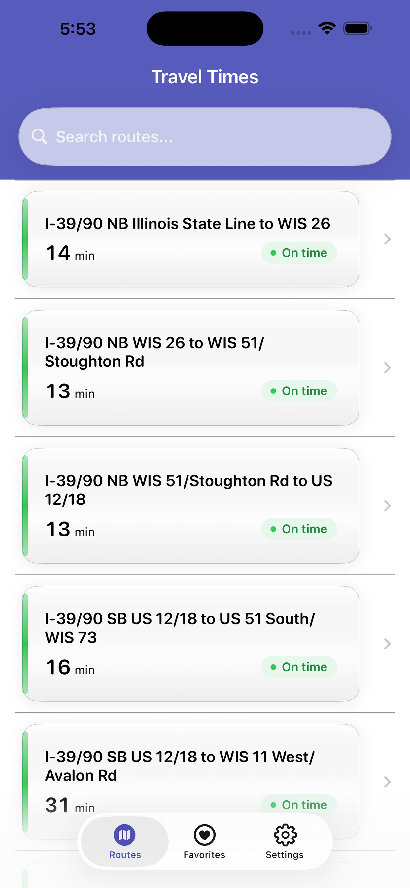
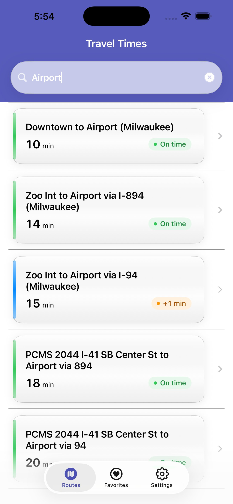
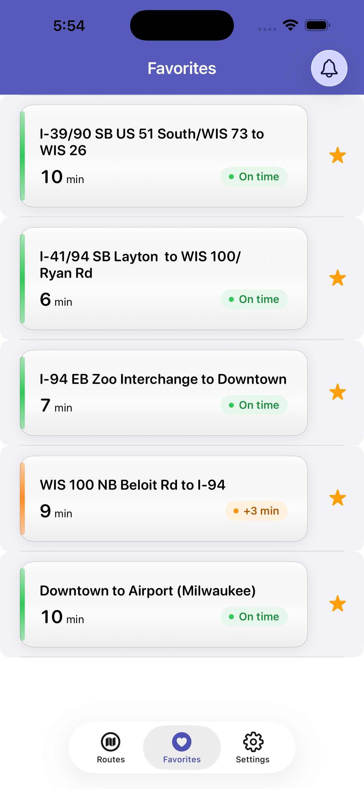
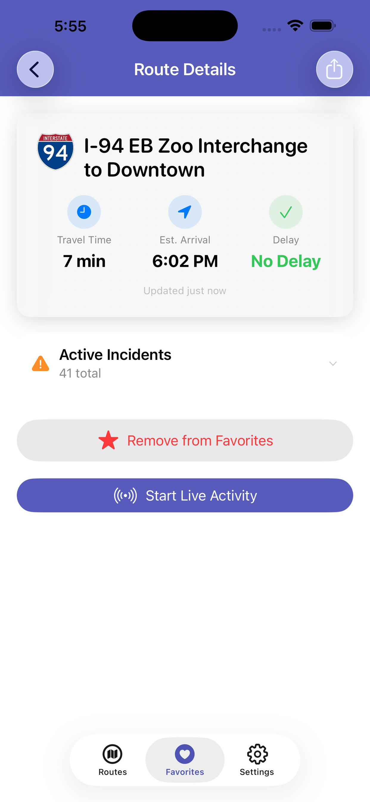
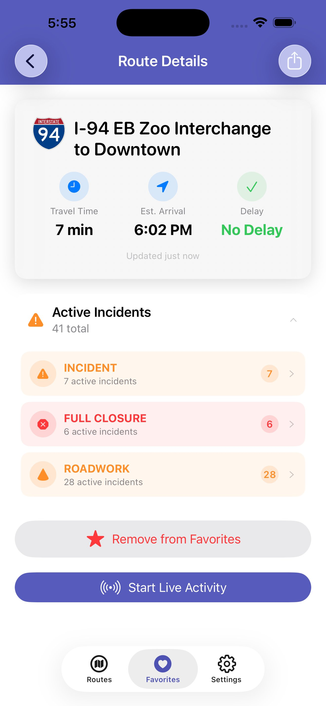
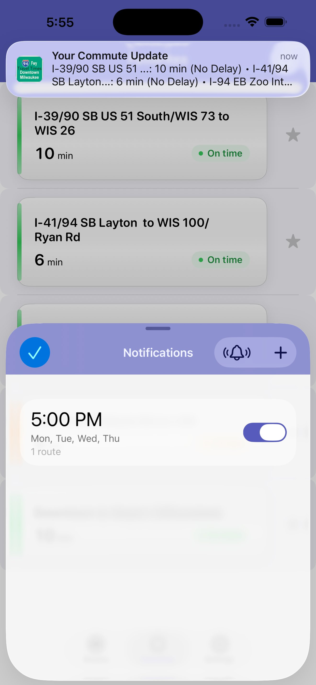
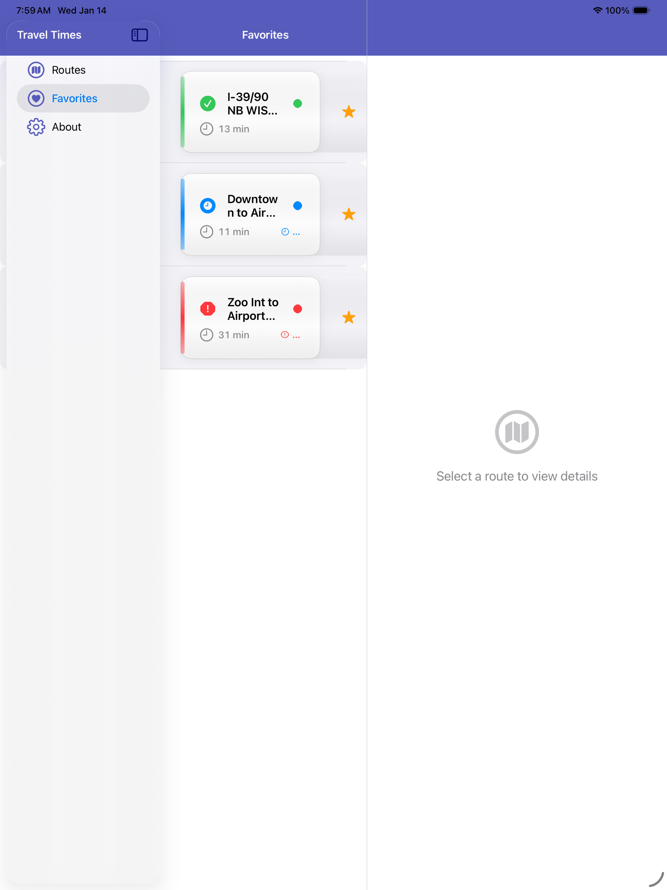
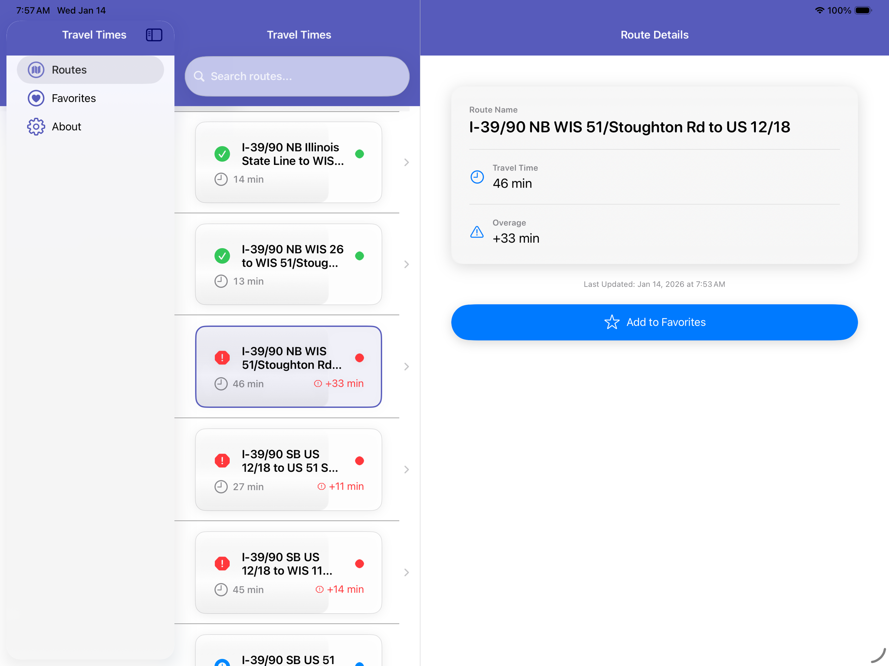
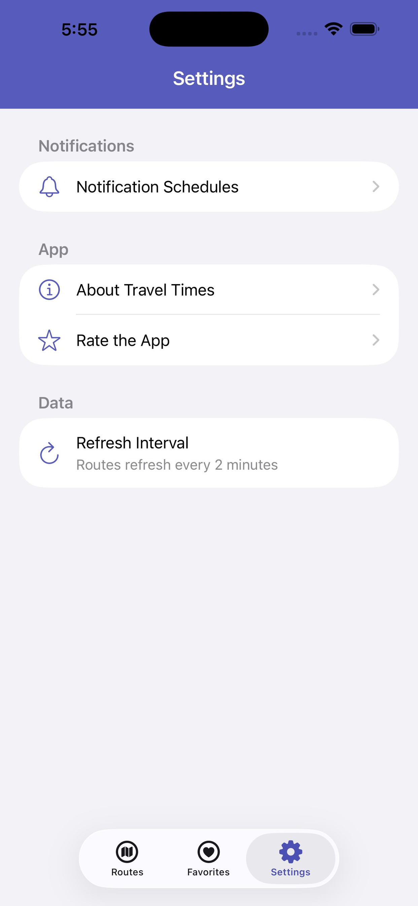

# Travel Times User Guide

Landing-page ready source copy for `https://traveltimesapp.com/`.

Suggested page title: `Travel Times User Guide`
Suggested meta description: `Learn how to use Travel Times for iPhone, iPad, Apple Watch, Siri, Shortcuts, notifications, Live Activities, route groups, and real-time commute alerts.`
Suggested URL: `/guide`
Last reviewed against the app codebase: July 7, 2026
Screenshot assets used below are stored in `docs/assets/traveltimes-guide/`.

## Page Introduction

Travel Times is built for one job: showing how your regular drive looks right now. It reports live travel times and delay status for supported highway routes, then keeps your most important routes available from the route list, Favorites, Siri, Shortcuts, notifications, Apple Watch, and Live Activities.

Travel Times is not a turn-by-turn navigation app. It does not need your location. The app shows route status for known corridors so you can decide whether to leave now, wait, or choose another familiar route.

## Requirements

- iPhone or iPad running iOS 26 or later.
- Optional Apple Watch features require a paired Apple Watch running watchOS 10 or later.
- Notifications require notification permission.
- Live Activities require Live Activities to be enabled for Travel Times in iOS Settings.
- Siri and Shortcuts features require Siri and Shortcuts to be available on the device.
- Favorites sync uses iCloud key-value storage when iCloud is available, with local storage as a fallback.

## Quick Start

1. Open Travel Times.
2. Review the Routes tab to see current travel times.
3. Pull down on the route list to refresh live data.
4. Tap a route to open its details.
5. Add your regular routes to Favorites.
6. Use Settings > Commute to set up route groups, notification schedules, and automatic Live Activities.
7. Add the Apple Watch complication or use Siri shortcuts once your favorite routes are set.

## Reading the Routes Tab

The Routes tab is the main screen. It lists every supported route with the current travel time, delay status, and last updated time.

_Routes on iPhone: search sits above scannable route cards with travel time, text status, and a colored status rule._

Each route card includes:

- Route name, such as `I-94 EB Zoo Interchange to Downtown`.
- Current travel time, such as `14 min`.
- Delay status, such as `On time`, `+4 min`, or `+12 min`.
- A colored status rule on the left edge of the card.
- A chevron to open route details.

Status colors mean:

- Green: on time.
- Orange: minor delay, 1 to 5 minutes.
- Red: major delay, 6 minutes or more.

Status is always shown with text, not color alone.

### Last Updated

The timestamp above the route list shows when the displayed data was last refreshed. For same-day data, it appears as `Updated at 7:13 AM`. Older saved data includes the day.

### Refreshing Routes

To refresh manually:

1. Open the Routes tab.
2. Pull down on the list.
3. Release when the refresh control appears.

Travel Times also refreshes when you return to the app if the saved route data is stale.

### Offline and Cached Data

If the network is unavailable, Travel Times uses the most recent saved route data when possible. The app shows an offline banner and keeps the timestamp visible so you can tell how old the saved information is.

If no saved data is available, the app shows a retry action.

## Searching Routes

Use the search field at the top of the Routes tab to find a route by name.

Search behavior:

- Search matches route names.
- Results update as you type.
- Matching text is highlighted in results.
- If no routes match, Travel Times shows a clear empty state and a `Clear Search` action.

_Search narrows the route list immediately, which is useful when a corridor has several similarly named routes._

On iPad with a hardware keyboard:

- `Command-R`: refresh routes.
- `Command-F`: focus search.
- `Escape`: clear search or dismiss the keyboard.
- `Command-1`: open Routes.
- `Command-2`: open Favorites.
- `Command-3`: open Settings.

## Adding and Removing Favorites

Favorites keep your regular drives at the top of the experience. They also power Apple Watch, notification scheduling, route groups, commute briefs, and Siri commute answers.

### Add a Favorite from the Routes Tab

1. Open the Routes tab.
2. Swipe left on a route card.
3. Tap `Favorite`.

If the route is already a favorite, the swipe action changes to `Unfavorite`.

### Add or Remove a Favorite from Route Details

1. Tap a route to open Route Details.
2. Tap `Add to Favorites`.
3. If the route is already saved, tap `Remove from Favorites`.

Travel Times confirms the change with haptic feedback and an accessibility announcement.

### Use the Favorites Tab

The Favorites tab lists saved routes. Favorite routes update with fresh travel times when the main route data refreshes.

_Favorites keep saved routes one tap away and expose notification setup from the bell button._

In Favorites you can:

- Tap a favorite to open Route Details.
- Pull to refresh.
- Drag favorites to reorder them.
- Swipe left to delete a favorite.
- Tap the bell button to manage notification schedules.

If you have no favorites, the Favorites tab shows a `Browse Routes` action.

## Route Details

Tap any route to open Route Details.

The detail screen shows:

- Route name and highway shield when a matching shield is available.
- Current travel time.
- Estimated arrival time based on the current travel time.
- Delay status.
- Last updated time.
- Matching traffic incidents when incident data is available.
- Favorite button.
- Share button.
- Live Activity button when supported and enabled.

_Route Details collects the current route status, arrival estimate, favorite state, share action, and Live Activity control in one place._

### Estimated Arrival

Estimated arrival adds the current travel time to the current clock time. For example, if it is 7:30 AM and the route is 16 minutes, the estimated arrival appears as `7:46 AM`.

### Incidents

If route-related incidents are available, Travel Times shows them below the main route card. If there are no matching incidents, that section stays hidden.

_Incident summaries appear under Route Details when matching incident data is available._

### Sharing a Route

To share a route status:

1. Open Route Details.
2. Tap the share icon in the navigation bar.
3. Choose Messages, Mail, or another share destination.

The shared text includes the route name, current travel time, delay, freshness timestamp, and `traveltimesapp.com`.

## Commute Brief

The commute brief summarizes the routes that matter most to you. It is designed for a quick answer: which route is best, which is worst, and whether anything is delayed.

The app builds the brief from your route groups when available. If no route group exists, it falls back to Favorites.

The same commute brief powers:

- The in-app commute summary.
- The Siri and Shortcuts `Check commute` answer.

## Route Groups

Route groups let you organize favorite routes into commute sets such as Morning, Evening, Airport, Weekend, or School Pickup.

To create a route group:

1. Open Settings.
2. Tap `Route Groups`.
3. Tap the add button.
4. Enter a group name.
5. Select one or more favorite routes.
6. Tap Save.

To edit a route group:

1. Open Settings > Route Groups.
2. Tap an existing group.
3. Rename it or change the selected routes.
4. Tap Save.

To delete a route group:

1. Open Settings > Route Groups.
2. Swipe left on the group.
3. Tap Delete.

Route groups require favorites. If you have no favorite routes yet, add favorites from the Routes tab or Route Details first.

## Notification Schedules

Notification schedules send route reminders on selected days and times. They are useful for regular departure windows, such as weekday mornings or evening commutes.

You can open notification schedules from either:

- Favorites tab > bell button.
- Settings > Commute > Notification Schedules.

_Schedules can be managed from Favorites or Settings, and sample notifications help confirm alerts are working._

### Create a Schedule

1. Open Notification Schedules.
2. Tap the add button.
3. Select one or more favorite routes.
4. Select the days of the week.
5. Choose a time.
6. Optionally enable `Only notify when delayed`.
7. If delay-only is enabled, set the delay threshold in minutes.
8. Tap Save.

### Smart Alerts

`Only notify when delayed` makes a schedule quieter. When enabled, Travel Times only schedules the alert when at least one selected route is delayed by the threshold you choose.

Example:

- Selected routes: I-94 EB and I-43 SB.
- Delay threshold: 10 minutes.
- If both routes are under 10 minutes of delay, the schedule is skipped.
- If I-43 SB is delayed by 11 minutes, the notification includes that delayed route.

### Manage Schedules

In the notification schedule list you can:

- Turn a schedule on or off with the switch.
- Tap a schedule to edit it.
- Swipe left to delete it.
- Tap the test notification button to send a sample notification after 5 seconds.

If notifications are disabled, Travel Times shows an option to open iOS Settings.

## Live Activities

Live Activities keep one route visible on the Lock Screen, Dynamic Island, and StandBy while you are actively tracking it.

### Start a Live Activity Manually

1. Open a route.
2. Tap `Start Live Activity`.
3. Lock your phone or view the Dynamic Island to see the route status.

To stop it:

1. Return to Route Details.
2. Tap `End Live Activity`.

### Start a Live Activity Automatically

Auto Live Activity starts a Live Activity for one favorite route when fresh route data arrives while the app is active.

To enable it:

1. Open Settings.
2. Tap `Auto Live Activity`.
3. Choose a favorite route.

To turn it off:

1. Open Settings.
2. Tap `Auto Live Activity`.
3. Choose `Off`.

Automatic Live Activities are foreground-only. Travel Times does not surprise-start a new Lock Screen surface from the background.

### Open a Route from a Live Activity

Tap the Live Activity to open Travel Times directly to that route.

## Siri and Shortcuts

Travel Times exposes app shortcuts for common actions.

Try phrases such as:

- `Open Travel Times`
- `Show my routes in Travel Times`
- `Show my favorites in Travel Times`
- `Open favorites in Travel Times`
- `Refresh Travel Times`
- `Update routes in Travel Times`
- `Check my commute in Travel Times`
- `How is my commute in Travel Times`

`Check my commute` returns an inline answer without opening the app. It summarizes your commute brief from route groups or favorites.

You can also build personal automations in the Shortcuts app using the Travel Times actions.

## Apple Watch

Travel Times includes an Apple Watch companion app focused on favorites.

To use the Watch app:

1. Add favorite routes on iPhone.
2. Open Travel Times on Apple Watch.
3. Review the favorite route cards.
4. Tap a route to open its detail view.

Watch behavior:

- Favorite routes sync from the iPhone.
- Delayed routes sort toward the top.
- The header shows `ALL CLEAR` when no favorites are delayed.
- The header shows the number of delayed favorites when delays exist.
- If the Watch data is stale, tap the refresh footer to ask the iPhone to fetch fresh data.

If no favorites are available, the Watch app prompts you to add routes on iPhone.

## Watch Complication

The Watch complication shows your first favorite route and its current travel time.

To add it:

1. Open the Watch app on iPhone, or edit the watch face on Apple Watch.
2. Choose a face that supports rectangular complications.
3. Add the Travel Times complication.

The complication updates when the iPhone sends fresh favorite route data to the Watch.

## iPad

On iPad, Travel Times uses a split-view layout.

The sidebar includes:

- Routes.
- Favorites.
- Settings.

The route list appears beside the sidebar, and Route Details open in a detail column. This makes it easier to scan routes and keep a selected route visible.

_On iPad, the sidebar and route list stay visible while the detail pane is ready for the selected route._

_Selecting a route keeps the list and full detail view side by side._

On iPad and pointer devices, route rows also support context menus. Long-press or right-click a route to:

- View details.
- Add or remove the route from Favorites.
- Copy the route name.
- Share a short route status.

## Settings

Settings is organized around commute configuration, app information, and data behavior.

_Settings groups commute controls, app information, and data refresh behavior._

Commute settings:

- `Notification Schedules`: create, edit, test, enable, disable, and delete route alerts.
- `Route Groups`: group favorite routes for commute briefs.
- `Auto Live Activity`: choose one favorite route to start automatically.

App settings:

- About Travel Times.
- Rate the app.

Data information:

- Refresh interval: routes refresh automatically when stale and can be refreshed manually.

## Privacy and Data

Travel Times does not require location permission because it does not track where you are. It reports live route status for predefined corridors.

Data used by the app:

- Live route data from the Travel Times route API.
- Traffic incident data when available.
- Favorite routes stored locally and synced through iCloud when available.
- Notification schedules stored on device.
- Route groups and Auto Live Activity preference stored on device.

If iCloud is unavailable, favorites continue to work locally.

## Accessibility

Travel Times is designed for a five-second glance, but it also supports users who rely on accessibility features.

Accessibility features include:

- VoiceOver labels and hints for route cards and controls.
- Spoken route status, including delay text.
- Dynamic Type support, including accessibility text sizes.
- Reduced Motion support for discoverability animations.
- Reduced Transparency fallbacks for glass effects.
- High-contrast adaptive colors.
- Haptic feedback for important actions.
- 44-point minimum touch targets on key controls.
- Keyboard shortcuts on iPad.

## Troubleshooting

### I do not see any routes.

Check your network connection and pull to refresh. If the app has saved data, it will show cached routes. If no saved data exists, use the retry action.

### The route data looks old.

Check the timestamp above the route list. Pull down on the Routes tab to force a refresh.

### I cannot create a notification schedule.

Notification schedules require favorite routes. Add at least one favorite first.

### Notifications are not arriving.

Open Settings > Commute > Notification Schedules and confirm the schedule is enabled. Then check iOS Settings to make sure notifications are allowed for Travel Times.

If `Only notify when delayed` is enabled, the notification may be skipped when no selected route meets the delay threshold.

### Live Activities do not appear.

Make sure Live Activities are enabled for Travel Times in iOS Settings. Then open a route and use `Start Live Activity`, or choose a route in Settings > Commute > Auto Live Activity.

### Siri says no commute routes are set up.

Add favorites first. For a more focused answer, create a route group in Settings > Commute > Route Groups.

### My Watch does not show routes.

Add favorites on iPhone and open Travel Times on Apple Watch. If the data is stale, tap the refresh footer on the Watch app.

### My favorites are not syncing.

Make sure you are signed in to iCloud. Favorites still work locally if iCloud is unavailable.

## Landing Page Integration Notes

This guide can be used as a full support page or split into landing-page sections.

Recommended landing-page sections:

1. `Start with Favorites`: explain favorites as the setup step for Watch, notifications, Live Activities, groups, and Siri.
2. `Know your commute in one glance`: show route cards, status colors, and the last updated timestamp.
3. `Alerts only when they matter`: explain scheduled notifications and delay thresholds.
4. `Your route on the Lock Screen`: show manual and automatic Live Activities.
5. `Ask Siri before you leave`: highlight the inline `Check my commute` answer.
6. `On your wrist`: show Apple Watch favorites and complication.
7. `Built for accessibility`: summarize VoiceOver, Dynamic Type, and no-location-required behavior.
8. `Troubleshooting and FAQ`: reuse the troubleshooting section above.

Suggested screenshot slots:

Available guide assets:

- `assets/traveltimes-guide/iphone-routes.png`: Routes tab with route cards and search.
- `assets/traveltimes-guide/iphone-search-airport.png`: search results filtered to airport routes.
- `assets/traveltimes-guide/iphone-favorites.png`: Favorites tab with saved routes and notification access.
- `assets/traveltimes-guide/iphone-route-detail.png`: Route Details with travel time, estimated arrival, incidents, share, favorite, and Live Activity controls.
- `assets/traveltimes-guide/iphone-route-incidents.png`: expanded incident summaries.
- `assets/traveltimes-guide/iphone-notification-schedule.png`: notification schedule list with a sample commute notification.
- `assets/traveltimes-guide/iphone-settings.png`: Settings overview.
- `assets/traveltimes-guide/ipad-favorites-split-view.png`: iPad Favorites split view.
- `assets/traveltimes-guide/ipad-route-detail.png`: iPad selected-route detail split view.

Recommended capture gaps:

- Notification schedule editor with smart alerts enabled.
- Settings > Commute showing Notification Schedules, Route Groups, and Auto Live Activity after those controls are populated.
- Route Groups create/edit flow.
- Commute Brief in-app summary.
- Live Activity on Lock Screen or Dynamic Island.
- Siri inline `Check my commute` answer.
- Apple Watch favorite route list.
- Watch complication.

Suggested CTA copy:

- `Download Travel Times`
- `Set up your first favorite route`
- `Get commute alerts before you leave`
- `Ask Siri how your commute looks`

Suggested support-page intro:

`New to Travel Times? Start by adding the routes you drive most often. Favorites power the Watch app, notification schedules, Live Activities, route groups, and Siri commute answers, so the app can show the routes that matter before you leave.`
